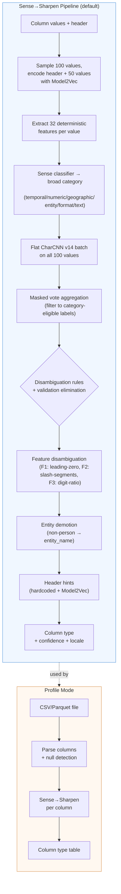

# FineType

[](https://meridian.online/projects/finetype/)

Precision format detection for text data. FineType classifies strings into a rich taxonomy of 250 semantic types — each type is a **transformation contract** that guarantees a DuckDB cast expression will succeed.

```
$ finetype infer -i "192.168.1.1"
technology.internet.ip_v4

$ finetype infer -i "2024-01-15T10:30:00Z"
datetime.timestamp.iso_8601

$ finetype infer -i "hello@example.com"
identity.person.email
```

## Features

- **250 semantic types** across 7 domains — dates, times, IPs, emails, UUIDs, financial identifiers, currencies, geospatial formats, medical codes, and more
- **Transformation contracts** — each type maps to a DuckDB SQL expression that guarantees successful parsing. 99.9% actionability across 120 tested types.
- **Locale-aware** — validates 65+ locales for postal codes, 46+ for phone numbers, 32+ for month/day names. Post-hoc detection returns detected region.
- **Sense→Sharpen pipeline** — Model2Vec semantic understanding + masked CharCNN voting + feature-based disambiguation. 95.7% label accuracy on 30-dataset profile eval (186 columns).
- **Feature disambiguation** — 32 deterministic features (parse tests, character stats, structural patterns) resolve confusable type pairs via post-vote rules
- **MCP server** — `finetype mcp` exposes type inference to AI agents via Model Context Protocol (6 tools + taxonomy resources)
- **DuckDB load** — `finetype load -f data.csv | duckdb` generates runnable CREATE TABLE statements with typed columns
- **Column-mode inference** — distribution-based disambiguation resolves ambiguous types (dates, years, coordinates)
- **DuckDB extension** — 5 scalar functions: `finetype()`, `finetype_detail()`, `finetype_cast()`, `finetype_unpack()`, `finetype_version()`
- **Pure Rust** — no Python runtime or dependencies, Candle ML framework for training and inference

## Installation

### Homebrew (macOS)

```bash
brew install meridian-online/tap/finetype
```

### Cargo

```bash
cargo install finetype-cli
```

### From Source

```bash
git clone https://github.com/meridian-online/finetype
cd finetype
cargo build --release
./target/release/finetype --version
```

## Usage

### CLI

```bash
# Classify a single value
finetype infer -i "bc89:60a9:23b8:c1e9:3924:56de:3eb1:3b90"

# Column-mode inference (distribution-based disambiguation)
finetype infer -f column_values.txt --mode column

# Profile a CSV file — detect all column types
finetype profile -f data.csv

# Generate a runnable DuckDB CREATE TABLE from file profiling
finetype load -f data.csv | duckdb

# Start MCP server for AI agent integration
finetype mcp

# Train a CharCNN model
finetype train --data training.ndjson --output models/my-model --epochs 10

# Generate synthetic training data
finetype generate --samples 1000 --output training.ndjson

# Validate generator ↔ taxonomy alignment
finetype check

# Show taxonomy (filter by domain, category)
finetype taxonomy --domain datetime

# Export JSON Schema for a type (supports glob patterns)
finetype schema "datetime.date.*" --pretty
```

### DuckDB Extension

```sql
-- Install and load
INSTALL finetype FROM community;
LOAD finetype;

-- Classify a single value
SELECT finetype('192.168.1.1');
-- → 'technology.internet.ip_v4'

-- Classify a column with detailed output (type, confidence, DuckDB broad type)
SELECT finetype_detail(value) FROM my_table;
-- → '{"type":"datetime.date.mdy_slash","confidence":0.98,"broad_type":"DATE"}'

-- Normalize values for safe TRY_CAST (dates → ISO, booleans → true/false)
SELECT finetype_cast(value) FROM my_table;

-- Recursively classify JSON fields
SELECT finetype_unpack(json_col) FROM my_table;

-- Check extension version
SELECT finetype_version();
```

The extension embeds model weights at compile time — no external files needed.

### MCP Server

FineType exposes type inference to AI agents via the [Model Context Protocol](https://modelcontextprotocol.io/). Configure your MCP client to launch `finetype mcp` as a stdio subprocess.

**Tools (6):**

| Tool | Purpose |
|---|---|
| `infer` | Classify values (single or column mode with header) |
| `profile` | Profile all columns in CSV file (path or inline data) |
| `ddl` | Generate CREATE TABLE DDL from file profiling |
| `taxonomy` | Search/filter type taxonomy by domain/category/query |
| `schema` | Export JSON Schema contract for type(s), supports globs |
| `generate` | Generate synthetic sample data for a type |

**Resources:** `finetype://taxonomy`, `finetype://taxonomy/{domain}`, `finetype://taxonomy/{domain}.{category}.{type}`

All tools return JSON primary content + markdown summary.

### As a Library

```rust
use finetype_model::Classifier;

let classifier = Classifier::load("models/default")?;
let result = classifier.classify("hello@example.com")?;

println!("{} (confidence: {:.2})", result.label, result.confidence);
// → identity.person.email (confidence: 0.97)
```

## Taxonomy

FineType recognizes **250 types** across **7 domains**:

| Domain | Types | Examples |
|--------|-------|----------|
| `datetime` | 84 | ISO 8601, RFC 2822, Unix timestamps, CJK dates, Apache CLF, timezones, month/day names (32+ locales) |
| `representation` | 36 | Integers, floats, booleans, numeric codes, hex colors, JSON, CAS numbers, SMILES, InChI |
| `technology` | 28 | IPv4/v6, MAC, URLs, UUIDs, ULIDs, DOIs, hashes, JWTs, AWS ARNs, Docker refs, CIDRs, git SHAs |
| `identity` | 34 | Names, emails, phone numbers (46+ locales), credit cards, SSNs, VINs, medical codes (ICD-10, CPT, LOINC) |
| `finance` | 31 | IBAN, SWIFT/BIC, ISIN, CUSIP, SEDOL, LEI, FIGI, currency amounts (7 format variants), routing numbers |
| `geography` | 25 | Lat/lon, countries, cities, postal codes (65+ locales), WKT, GeoJSON, H3, geohash, Plus Codes, MGRS |
| `container` | 12 | JSON objects, CSV rows, query strings, key-value pairs |

Each type is a **transformation contract** — if FineType predicts `datetime.date.mdy_slash`, that guarantees `strptime(value, '%m/%d/%Y')::DATE` will succeed.

Label format: `{domain}.{category}.{type}` (e.g., `technology.internet.ip_v4`). Locale-specific types append a locale suffix: `identity.person.phone_number.EN_AU`.

See [`labels/`](labels/) for the complete taxonomy (YAML definitions with validation schemas, transforms, and sample data).

## Performance

### Model Accuracy

| Model | Architecture | Profile Eval | Actionability | Classes |
|-------|-------------|----------|---------|---------|
| **Sense→Sharpen** | Model2Vec + CharCNN v14 + features | **95.7% label, 97.3% domain** (178/186) | **99.9%** | **250** |
| Tiered v2 | 34 CharCNNs (T0→T1→T2) | `--sharp-only` fallback | — | 164 |

**Profile eval:** 30 real-world datasets, 186 format-detectable columns. **Actionability:** 232,321/232,541 values transformed successfully across 120 types.

### Latency & Throughput

- **Model load time**: 66 ms (cold), 25-30 ms (warm)
- **Single inference**: p50=26 ms, p95=41 ms (includes CLI startup)
- **Batch throughput**: 600-750 values/sec on CPU
- **Memory footprint**: 8.5 MB peak RSS

## Architecture

### Inference Pipeline

FineType operates in three modes — single-value, column, and profile — each building on the previous.

The default **Sense→Sharpen** column pipeline:



**Pipeline stages explained:**

| Stage | What it does | Where |
|---|---|---|
| **Model2Vec encoding** | Encodes column header and sample values into 256-dim embeddings using potion-base-4M static embeddings. | `finetype-model` |
| **Feature extraction** | Computes 32 deterministic features per value: 10 parse tests (is_valid_date, is_valid_email, etc.), 14 character statistics (digit ratio, alpha ratio, case patterns), 8 structural features (has_leading_zero, segment counts, dot patterns). | `finetype-model` |
| **Sense classifier** | Cross-attention over Model2Vec embeddings predicts broad category (6 classes) and entity subtype (4 classes). ~3.6ms/column. | `finetype-model` |
| **Flat CharCNN** | Character-level CNN (250 classes) classifies each sample value independently. Per-char integer encoding, 3-layer CNN with max-pooling. | `finetype-model` |
| **Masked vote aggregation** | Filters CharCNN votes to Sense-eligible labels via `LabelCategoryMap`. Safety valve: falls back to unmasked when confidence is low or all votes filtered. | `finetype-model` |
| **Disambiguation** | Rule-based overrides for ambiguous type pairs: US/EU dates, lat/lon, year detection, duration, UTC offset, percentage-without-sign demotion. Validation-based candidate elimination rejects types where >50% of values fail JSON Schema validation. | `finetype-model` |
| **Feature disambiguation** | Post-vote rules using deterministic features: F1 (leading-zero → numeric_code for postal_code/cpt), F2 (slash-segments → docker_ref), F3 (digit-ratio+dots → hs_code). | `finetype-model` |
| **Entity demotion** | When Sense detects non-person entity subtype and CharCNN votes full_name, demotes to entity_name. | `finetype-model` |
| **Header hints** | Hardcoded header mappings (priority) + Model2Vec semantic similarity matching. Geography protection and measurement disambiguation guards. | `finetype-model` |
| **Profile** | CSV/Parquet parsing with null detection, then column-mode inference on each column. Outputs a type table with confidence scores. | `finetype-cli` |

### Crates

| Crate | Role | Key Dependencies |
|-------|------|------------------|
| `finetype-core` | Taxonomy parsing, tokenizer, synthetic data generation, validation | `serde_yaml`, `fake`, `chrono`, `uuid`, `jsonschema` |
| `finetype-model` | Flat CharCNN + Sense→Sharpen inference, feature extraction, column-mode disambiguation, Model2Vec | `candle-core`, `candle-nn` |
| `finetype-cli` | Binary: CLI commands (infer, profile, load, check, generate, taxonomy, schema, train, mcp) | `clap`, `csv` |
| `finetype-mcp` | MCP server library (rmcp v1.1.0, 6 tools, taxonomy resources) | `rmcp`, `tokio` |
| `finetype-duckdb` | DuckDB extension: 5 scalar functions with embedded model | `duckdb`, `libduckdb-sys` |
| `finetype-eval` | Evaluation binaries (profile, actionability, GitTables, SOTAB) | `csv`, `duckdb`, `arrow` |
| `finetype-train` | Pure Rust ML training (Sense, Entity, CharCNN, data pipeline, Model2Vec) | `candle-core`, `candle-nn`, `duckdb` |
| `finetype-build-tools` | Build utilities (DuckDB extension metadata) | — |
| `finetype-candle-spike` | ML framework feasibility testing | `candle-core`, `candle-nn` |

### Repository Structure

```
finetype/
├── crates/
│   ├── finetype-core/          # Taxonomy, tokenizer, data generation, validation
│   ├── finetype-model/         # Candle CNN + Sense→Sharpen, feature extraction, column-mode
│   ├── finetype-cli/           # CLI binary (10 commands)
│   ├── finetype-mcp/           # MCP server library (rmcp, 6 tools)
│   ├── finetype-duckdb/        # DuckDB extension (5 scalar functions)
│   ├── finetype-eval/          # Evaluation binaries (Rust, no Python)
│   ├── finetype-train/         # Pure Rust ML training (Candle)
│   ├── finetype-build-tools/   # Build utilities
│   └── finetype-candle-spike/  # ML feasibility spike
├── labels/                     # Taxonomy definitions (250 types, 7 domains, YAML)
├── models/                     # Pre-trained models (Sense, CharCNN, Model2Vec, Entity)
├── eval/                       # Evaluation infrastructure (GitTables, SOTAB, profile)
├── specs/                      # Spike findings and research
├── decisions/                  # Architectural decision records (MADR format)
└── .github/workflows/          # CI/CD: fmt, clippy, test, check; release cross-compile
```

### Why Sense→Sharpen?

Column classification is a two-stage problem: first determine *what kind* of data a column contains (temporal, numeric, geographic, etc.), then identify the *specific type* within that category. The Sense→Sharpen pipeline mirrors this:

1. **Sense** uses Model2Vec embeddings of the column header and sample values to predict a broad category. This is fast (~3.6ms) and leverages semantic information (column names like "timestamp" or "latitude") that character-level models miss.

2. **Sharpen** runs a flat CharCNN on individual values but masks the output to only category-eligible labels. This combines the character-pattern strength of CNNs (colons in MACs/IPv6, `@` in emails, dashes in UUIDs) with Sense's category guidance to eliminate impossible predictions.

3. **Feature disambiguation** applies 32 deterministic features post-vote to resolve confusable type pairs that share character patterns but differ in structural properties (leading zeros, segment counts, digit ratios).

A legacy tiered architecture (34 specialized CharCNNs in a T0→T1→T2 hierarchy) is available via `--sharp-only` for cases where Sense model files are absent.

### Why Candle?

Pure Rust, no Python runtime, no external C++ dependencies. Integrates cleanly with the DuckDB extension as a single binary with embedded weights. Good Metal/CUDA support for training.

## Development

```bash
# Build
cargo build --release

# Run all tests
cargo test --all

# Validate taxonomy (generator ↔ definition alignment)
cargo run --release -- check

# Infer a type
cargo run --release -- infer -i "hello@example.com"

# Profile a CSV
cargo run --release -- profile -f data.csv

# Generate a DuckDB load script
cargo run --release -- load -f data.csv

# Generate training data
cargo run --release -- generate --samples 500 --output training.ndjson

# Train a model (auto-detects Metal/CUDA/CPU)
./scripts/train.sh --samples 1500 --size small --epochs 10

# Run evaluation suite
make eval-report
```

Project tasks are tracked in [`backlog/`](backlog/) using [Backlog.md](https://backlog.md).

### Taxonomy Definitions

Each of the 250 types is defined in YAML under `labels/`:

```yaml
datetime.timestamp.iso_8601:
  title: "ISO 8601"
  description: "Full ISO 8601 timestamp with T separator and Z suffix"
  designation: universal
  locales: [UNIVERSAL]
  broad_type: TIMESTAMP
  format_string: "%Y-%m-%dT%H:%M:%SZ"
  transform: "strptime({col}, '%Y-%m-%dT%H:%M:%SZ')"
  validation:
    type: string
    pattern: "^\\d{4}-\\d{2}-\\d{2}T\\d{2}:\\d{2}:\\d{2}Z$"
  tier: [TIMESTAMP, timestamp]
  samples:
    - "2024-01-15T10:30:00Z"
```

Key fields: `broad_type` (target DuckDB type), `transform` (DuckDB SQL expression using `{col}` placeholder), `validation` (JSON Schema fragment for data quality).

## Known Limitations

### DuckDB `strptime` Locale Limitation

DuckDB's `strptime` function only accepts English month and day names. Non-English dates like `6 janvier 2025` will fail with `strptime(col, '%d %B %Y')`. There is no DuckDB locale setting to change this behavior.

**Affected types:** `datetime.date.long_full_month`, `datetime.date.abbreviated_month`, and related timestamp variants with non-English month/day names.

**Workaround:** FineType's locale detection correctly identifies non-English dates, but transformation must normalize to English first. See [Locale Support Guide](docs/LOCALE_GUIDE.md) for examples.

## License

MIT — see [`LICENSE`](LICENSE)

## Contributing

Contributions welcome! Please open an issue or PR.

## Credits

Part of the [Meridian](https://meridian.online) project. See the [FineType project page](https://meridian.online/projects/finetype/) for an overview.

Built with:
- [Candle](https://github.com/huggingface/candle) — Rust ML framework
- [DuckDB](https://duckdb.org) — Analytical database
- [rmcp](https://github.com/anthropics/rmcp) — Rust MCP SDK
- [Serde](https://serde.rs) — Serialization
