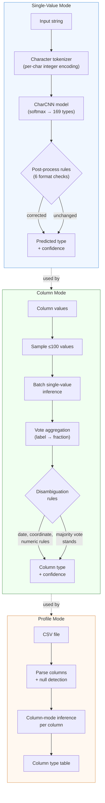

# FineType

[](https://noon.sh/projects/finetype/)

> **Early Development** — FineType is under active development. Expect breaking changes to taxonomy labels, CLI arguments, library APIs, and model formats between releases. Pin to a specific version if stability matters for your use case.

Precision format detection for text data. FineType classifies strings into a rich taxonomy of 169 semantic types — each type is a **transformation contract** that guarantees a DuckDB cast expression will succeed.

```
$ finetype infer -i "192.168.1.1"
technology.internet.ip_v4

$ finetype infer -i "2024-01-15T10:30:00Z"
datetime.timestamp.iso_8601

$ finetype infer -i "hello@example.com"
identity.person.email
```

## Features

- **169 semantic types** across 6 domains — dates, times, IPs, emails, UUIDs, financial identifiers, and more
- **Transformation contracts** — each type maps to a DuckDB SQL expression that guarantees successful parsing
- **Locale-aware** — handles region-specific formats (16+ locales for dates, addresses, phone numbers)
- **Column-mode inference** — distribution-based disambiguation resolves ambiguous types (dates, years, coordinates)
- **DuckDB integration** — 5 scalar functions: `finetype()`, `finetype_detail()`, `finetype_cast()`, `finetype_unpack()`, `finetype_version()`
- **Fast inference** — Character-level CNN model (600+ classifications/sec, 8.5 MB memory)
- **Real-world validated** — 85-100% accuracy on format-detectable types in [GitTables benchmark](https://zenodo.org/record/5706316) (2,363 columns)
- **Pure Rust** — no Python runtime, Candle ML framework
- **213 tests** — taxonomy validation, model inference, column disambiguation, data generation

## Installation

### Homebrew (macOS)

```bash
brew install noon-org/tap/finetype
```

### Cargo

```bash
cargo install finetype-cli
```

### From Source

```bash
git clone https://github.com/noon-org/finetype
cd finetype
cargo build --release
./target/release/finetype --version
```

## Usage

### CLI

FineType provides 9 commands covering the full ML pipeline:

```bash
# Classify a single value
finetype infer -i "bc89:60a9:23b8:c1e9:3924:56de:3eb1:3b90"

# Classify from file (one value per line), JSON output
finetype infer -f data.txt --output json

# Column-mode inference (distribution-based disambiguation)
finetype infer -f column_values.txt --mode column

# Profile a CSV file — detect column types
finetype profile -f data.csv

# Generate synthetic training data
finetype generate --samples 1000 --output training.ndjson

# Train a CharCNN model
finetype train --data data/train.ndjson --epochs 10 --batch-size 64

# Evaluate model accuracy
finetype eval --data data/test.ndjson --model models/char-cnn-v6

# Evaluate on GitTables benchmark (column-mode vs row-mode)
finetype eval-gittables --dir eval/gittables

# Validate data quality against taxonomy schemas
finetype validate -f data.ndjson --strategy quarantine

# Validate generator ↔ taxonomy alignment
finetype check

# Show taxonomy (filter by domain, category, priority)
finetype taxonomy --domain datetime
```

### DuckDB Extension

```sql
-- Install and load
INSTALL finetype FROM community;
LOAD finetype;

-- Classify a single value
SELECT finetype('192.168.1.1');
-- → 'technology.internet.ip_v4'

-- Classify a column with detailed output (type, confidence, DuckDB broad type)
SELECT finetype_detail(value) FROM my_table;
-- → '{"type":"datetime.date.us_slash","confidence":0.98,"broad_type":"DATE"}'

-- Normalize values for safe TRY_CAST (dates → ISO, booleans → true/false)
SELECT finetype_cast(value) FROM my_table;

-- Recursively classify JSON fields
SELECT finetype_unpack(json_col) FROM my_table;

-- Check extension version
SELECT finetype_version();
```

The extension embeds model weights at compile time — no external files needed.

### As a Library

```rust
use finetype_model::Classifier;

let classifier = Classifier::load("models/default")?;
let result = classifier.classify("hello@example.com")?;

println!("{} (confidence: {:.2})", result.label, result.confidence);
// → identity.person.email (confidence: 0.97)
```

## Taxonomy

FineType recognizes **169 types** across **6 domains**:

| Domain | Types | Examples |
|--------|-------|----------|
| `datetime` | 46 | ISO 8601, RFC 2822, Unix timestamps, timezones, date formats |
| `technology` | 34 | IPv4, IPv6, MAC addresses, URLs, UUIDs, DOIs, hashes, user agents |
| `identity` | 35 | Names, emails, phones, passwords, credit cards, ISIN, CUSIP, LEI, SWIFT/BIC |
| `representation` | 27 | Integers, floats, booleans (binary/initials/terms), categorical, ordinal, hex colors, JSON |
| `geography` | 16 | Latitude, longitude, countries, cities, postal codes |
| `container` | 11 | JSON objects, CSV rows, query strings, key-value pairs |

Each type is a **transformation contract** — if the model predicts `datetime.date.us_slash`, that guarantees `strptime(value, '%m/%d/%Y')::DATE` will succeed.

Label format: `{domain}.{category}.{type}` (e.g., `technology.internet.ip_v4`). Locale-specific types append a locale suffix: `identity.person.phone_number.EN_AU`.

See [`labels/`](labels/) for the complete taxonomy (YAML definitions with validation schemas, transforms, and sample data). For a comparison with schema.org, Wikidata, and GitTables type systems, see [`docs/TAXONOMY_COMPARISON.md`](docs/TAXONOMY_COMPARISON.md).

## Performance

### Model Accuracy

| Model | Accuracy | Classes |
|-------|----------|---------|
| CharCNN v6 | **89.15%** | 169 |
| CharCNN v5 | 90.09% | 168 |
| CharCNN v4 | 91.62% | 159 |

### Real-World Evaluation (GitTables)

Evaluated against 2,363 annotated columns from 883 real-world CSV tables ([GitTables benchmark](https://zenodo.org/record/5706316)):

| Type Category | Accuracy | Example Types |
|---------------|----------|---------------|
| URLs | **89.7%** | `technology.internet.url` |
| Timestamps | **100%** | `datetime.timestamp.*` |
| Dates | **88.2%** | `datetime.date.*` |
| Country names | **100%** | `geography.location.country` |
| Person names | **80-85%** | `identity.person.*` |

Column-mode inference improves accuracy for ambiguous types: geography **+9.7%**, datetime **+4.8%**, year detection **15.7% → 27.5%**.

See [`eval/gittables/REPORT.md`](eval/gittables/REPORT.md) for the full evaluation.

### Latency & Throughput

- **Model load time**: 66 ms (cold), 25-30 ms (warm)
- **Single inference**: p50=26 ms, p95=41 ms (includes CLI startup)
- **Batch throughput**: 600-750 values/sec on CPU
- **Memory footprint**: 8.5 MB peak RSS

## Column-Mode Inference

Single-value classification can be ambiguous: is `01/02/2024` a US date (Jan 2) or EU date (Feb 1)? Is `1995` a year, postal code, or plain number?

Column-mode inference resolves this by analyzing the distribution of values in a column and applying disambiguation rules:

- **Date format disambiguation** — US vs EU slash dates, short vs long dates
- **Year detection** — 4-digit integers predominantly in 1900-2100 range
- **Coordinate resolution** — latitude vs longitude based on value ranges
- **Numeric type disambiguation** — ports, increments, postal codes, street numbers
- **Gender detection** — known gender value sets → `identity.person.gender`
- **Categorical detection** — low cardinality string columns, single-character columns
- **Boolean override** — prevents boolean misclassification for integer spreads and multi-value chars

```bash
# CLI column-mode
finetype infer -f column_values.txt --mode column

# CSV profiling (uses column-mode automatically)
finetype profile -f data.csv
```

## Architecture

### Inference Pipeline

FineType operates in three modes — single-value, column, and profile — each building on the previous:



**Pipeline stages explained:**

| Stage | What it does | Where |
|---|---|---|
| **Character tokenizer** | Encodes each character as an integer (0-127 ASCII + padding). Fixed-length input to the CNN. | `finetype-core` |
| **CharCNN** | 3-layer character-level CNN with max-pooling → softmax over 169 types. Trained on synthetic data from taxonomy generators. ~340 KB model. | `finetype-model` |
| **Post-processing** | 6 deterministic rules that correct known model confusions using format signals the model struggles with (e.g., `T` vs space in timestamps, `@` for email rescue, hash length check). | `finetype-model` |
| **Vote aggregation** | In column mode, runs single-value inference on a sample of up to 100 values, then counts votes per type. | `finetype-model` |
| **Disambiguation** | Rule-based overrides for ambiguous type pairs: US/EU dates (component > 12), lat/lon (value > 90), year (4-digit in 1900-2100), port (common port list), postal code (consistent digit length), gender detection, categorical (low cardinality), boolean override (integer spread). | `finetype-model` |
| **Profile** | CSV parsing with null detection, then column-mode inference on each column. Outputs a type table with confidence scores. | `finetype-cli` |

**Four crates:**

| Crate | Role | Key Dependencies |
|-------|------|------------------|
| `finetype-core` | Taxonomy parsing, tokenizer, synthetic data generation (73 tests) | `serde_yaml`, `fake`, `chrono`, `uuid` |
| `finetype-model` | Candle CharCNN inference, column-mode disambiguation (109 tests) | `candle-core`, `candle-nn` |
| `finetype-cli` | Binary: 11 CLI commands | `clap`, `csv` |
| `finetype-duckdb` | DuckDB extension: 5 scalar functions with embedded model | `duckdb`, `libduckdb-sys` |

**Repository structure:**

```
finetype/
├── crates/
│   ├── finetype-core/        # Taxonomy, tokenizer, data generation
│   ├── finetype-model/       # Candle CNN model, column-mode inference
│   ├── finetype-cli/         # CLI binary
│   └── finetype-duckdb/      # DuckDB extension (5 scalar functions)
├── labels/                   # Taxonomy definitions (169 types, 6 domains, YAML)
├── models/char-cnn-v6/       # Pre-trained model weights, config, label mapping
├── eval/gittables/           # GitTables real-world benchmark evaluation
├── backlog/                  # Project tasks and decisions (Backlog.md format)
└── .github/workflows/        # CI/CD: fmt, clippy, test, finetype check; release cross-compile
```

### Why Character-Level CNN?

Format types are defined by character patterns (colons in MACs/IPv6, `@` in emails, dashes in UUIDs, `T` separator in ISO 8601). Character-level models capture these patterns directly without tokenization overhead.

### Why Candle?

Pure Rust, no Python runtime, no external C++ dependencies. Integrates cleanly with the DuckDB extension as a single binary with embedded weights. Good Metal/CUDA support for training.

## Development

```bash
# Build
cargo build --release

# Run all tests (213)
cargo test --all

# Validate taxonomy (generator ↔ definition alignment)
cargo run --release -- check

# Infer a type
cargo run --release -- infer -i "hello@example.com"

# Profile a CSV
cargo run --release -- profile -f data.csv

# Generate training data
cargo run --release -- generate --samples 500 --output data/train.ndjson

# Train a model
cargo run --release -- train --data data/train.ndjson --epochs 10

# Evaluate model
cargo run --release -- eval --data data/test.ndjson --model models/char-cnn-v6
```

Project tasks are tracked in [`backlog/`](backlog/) using [Backlog.md](https://backlog.md).

### Taxonomy Definitions

Each of the 169 types is defined in YAML under `labels/`:

```yaml
datetime.timestamp.iso_8601:
  title: "ISO 8601"
  description: "Full ISO 8601 timestamp with T separator and Z suffix"
  designation: universal
  locales: [UNIVERSAL]
  broad_type: TIMESTAMP
  format_string: "%Y-%m-%dT%H:%M:%SZ"
  transform: "strptime({col}, '%Y-%m-%dT%H:%M:%SZ')"
  validation:
    type: string
    pattern: "^\\d{4}-\\d{2}-\\d{2}T\\d{2}:\\d{2}:\\d{2}Z$"
  tier: [TIMESTAMP, timestamp]
  release_priority: 5
  samples:
    - "2024-01-15T10:30:00Z"
```

Key fields: `broad_type` (target DuckDB type), `transform` (DuckDB SQL expression using `{col}` placeholder), `validation` (JSON Schema fragment for data quality).

## Data Validation

FineType includes a validation engine that checks data quality against the taxonomy's JSON Schema fragments. The pipeline is: **Infer → Validate → Transform**.

### CLI Usage

```bash
# Validate NDJSON file (each line has "value" and "label" fields)
finetype validate -f data.ndjson

# Validate plain text values against a specific type
finetype validate -f values.txt --label technology.internet.ip_v4

# Choose a strategy for handling invalid values
finetype validate -f data.ndjson --strategy quarantine   # (default) separate invalid values
finetype validate -f data.ndjson --strategy null          # replace invalid with NULL
finetype validate -f data.ndjson --strategy ffill         # forward-fill from last valid
finetype validate -f data.ndjson --strategy bfill         # backward-fill from next valid

# Output format (plain, json, csv)
finetype validate -f data.ndjson --output json
```

### Validation Strategies

| Strategy | Behavior | Use When |
|----------|----------|----------|
| `quarantine` | Invalid values collected in separate file, removed from output | You want to review and fix invalid data manually |
| `null` | Invalid values replaced with NULL | Missing data is acceptable and downstream can handle NULLs |
| `ffill` | Invalid values replaced with last valid value | Time-series data where carrying forward is appropriate |
| `bfill` | Invalid values replaced with next valid value | Backfilling is more appropriate than forward-filling |

### Schema Format

Each taxonomy type has an optional `validation` field containing a JSON Schema fragment:

```yaml
technology.internet.ip_v4:
  validation:
    type: string
    pattern: "^(?:(?:25[0-5]|2[0-4][0-9]|[01]?[0-9][0-9]?)\\.){3}(?:25[0-5]|2[0-4][0-9]|[01]?[0-9][0-9]?)$"
    minLength: 7
    maxLength: 15
```

Supported schema fields: `pattern` (regex), `minLength`, `maxLength`, `minimum`, `maximum`, `enum` (allowed value list).

### Library API

```rust
use finetype_core::validator::{validate_value, validate_column, InvalidStrategy};
use finetype_core::taxonomy::Validation;

// Single-value validation
let schema = taxonomy.get("technology.internet.ip_v4").unwrap().validation.as_ref().unwrap();
let result = validate_value("192.168.1.1", schema).unwrap();
assert!(result.is_valid);

// Column validation with strategy
let values = vec![Some("192.168.1.1"), Some("bad"), None, Some("10.0.0.1")];
let result = validate_column(&values, schema, InvalidStrategy::Quarantine).unwrap();
println!("Valid: {}, Invalid: {}", result.stats.valid_count, result.stats.invalid_count);
```

## Known Limitations

### Locale Support

FineType's training data generators support 16+ locales for locale-specific types (phone numbers, dates, addresses). However, the current production model uses **3-level labels** (169 types) and does not distinguish between locales at inference time.

**DuckDB `strptime` locale limitation:** DuckDB's `strptime` function only accepts English month and day names. Non-English dates like `6 janvier 2025` will fail with `strptime(col, '%d %B %Y')`. There is no DuckDB locale setting to change this behavior.

**Affected types:** Any type whose transform uses `%B` (full month name), `%b` (abbreviated month), `%A` (full day name), or `%a` (abbreviated day name) — primarily `datetime.date.long_full_month`, `datetime.date.abbreviated_month`, and related timestamp variants.

**Current status:** The 4-level label infrastructure (`domain.category.type.LOCALE`) exists in the training data pipeline but is reserved for future tiered models. The production model guarantees transformation contracts only for English-locale data. This is a deliberate scope decision — non-English locale support requires either a normalization layer or locale-aware transforms, both of which add significant complexity without clear demand.

## License

MIT — see [`LICENSE`](LICENSE)

## Contributing

Contributions welcome! Please open an issue or PR.

## Credits

Part of the [Noon](https://noon.sh) project. See the [FineType project page](https://noon.sh/projects/finetype/) for an overview.

Built with:
- [Candle](https://github.com/huggingface/candle) — Rust ML framework
- [DuckDB](https://duckdb.org) — Analytical database
- [Serde](https://serde.rs) — Serialization
