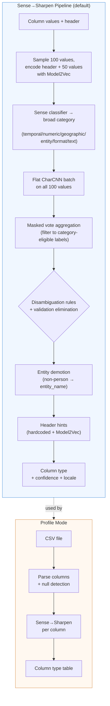

# FineType

[](https://noon.sh/projects/finetype/)

> **Early Development** — FineType is under active development. Expect breaking changes to taxonomy labels, CLI arguments, library APIs, and model formats between releases. Pin to a specific version if stability matters for your use case.

Precision format detection for text data. FineType classifies strings into a rich taxonomy of 164 semantic types — each type is a **transformation contract** that guarantees a DuckDB cast expression will succeed.

```
$ finetype infer -i "192.168.1.1"
technology.internet.ip_v4

$ finetype infer -i "2024-01-15T10:30:00Z"
datetime.timestamp.iso_8601

$ finetype infer -i "hello@example.com"
identity.person.email
```

## Features

- **163 semantic types** across 7 domains — dates, times, IPs, emails, UUIDs, financial identifiers, currencies, and more
- **Transformation contracts** — each type maps to a DuckDB SQL expression that guarantees successful parsing
- **Locale-aware** — validates 65+ locales for postal codes, 46+ for phone numbers, 27+ for month/day names. Post-hoc detection returns detected region.
- **Sense→Sharpen pipeline** — Model2Vec semantic understanding + masked CharCNN voting. 98.3% label accuracy on 21-dataset profile eval.
- **Column-mode inference** — distribution-based disambiguation resolves ambiguous types (dates, years, coordinates)
- **DuckDB integration** — 5 scalar functions: `finetype()`, `finetype_detail()`, `finetype_cast()`, `finetype_unpack()`, `finetype_version()`
- **Tiered inference** — 34 specialized CharCNN models in a T0→T1→T2 hierarchy (600+ classifications/sec, 8.5 MB memory)
- **Real-world validated** — 85-100% accuracy on format-detectable types in [GitTables benchmark](https://zenodo.org/record/5706316) (2,363 columns)
- **Pure Rust** — no Python runtime or dependencies, Candle ML framework for training and inference

## Installation

### Homebrew (macOS)

```bash
brew install noon-org/tap/finetype
```

### Cargo

```bash
cargo install finetype-cli
```

### From Source

```bash
git clone https://github.com/noon-org/finetype
cd finetype
cargo build --release
./target/release/finetype --version
```

## Usage

### CLI

```bash
# Classify a single value
finetype infer -i "bc89:60a9:23b8:c1e9:3924:56de:3eb1:3b90"

# Classify from file (one value per line), JSON output
finetype infer -f data.txt --output json

# Column-mode inference (distribution-based disambiguation)
finetype infer -f column_values.txt --mode column

# Profile a CSV file — detect column types
finetype profile -f data.csv

# Generate synthetic training data
finetype generate --samples 1000 --output training.ndjson

# Validate data quality against taxonomy schemas
finetype validate -f data.ndjson --strategy quarantine

# Validate generator ↔ taxonomy alignment
finetype check

# Show taxonomy (filter by domain, category, priority)
finetype taxonomy --domain datetime

# Export JSON Schema for a type (supports glob patterns)
finetype schema "datetime.date.*" --pretty
```

### DuckDB Extension

```sql
-- Install and load
INSTALL finetype FROM community;
LOAD finetype;

-- Classify a single value
SELECT finetype('192.168.1.1');
-- → 'technology.internet.ip_v4'

-- Classify a column with detailed output (type, confidence, DuckDB broad type)
SELECT finetype_detail(value) FROM my_table;
-- → '{"type":"datetime.date.us_slash","confidence":0.98,"broad_type":"DATE"}'

-- Normalize values for safe TRY_CAST (dates → ISO, booleans → true/false)
SELECT finetype_cast(value) FROM my_table;

-- Recursively classify JSON fields
SELECT finetype_unpack(json_col) FROM my_table;

-- Check extension version
SELECT finetype_version();
```

The extension embeds model weights at compile time — no external files needed.

### As a Library

```rust
use finetype_model::Classifier;

let classifier = Classifier::load("models/default")?;
let result = classifier.classify("hello@example.com")?;

println!("{} (confidence: {:.2})", result.label, result.confidence);
// → identity.person.email (confidence: 0.97)
```

## Taxonomy

FineType recognizes **163 types** across **7 domains**:

| Domain | Types | Examples |
|--------|-------|----------|
| `datetime` | 45 | ISO 8601, RFC 2822, Unix timestamps, timezones, month/day names (27+ locales) |
| `representation` | 32 | Integers, floats, booleans, numeric codes, categorical, ordinal, hex colors, JSON |
| `technology` | 24 | IPv4, IPv6, MAC addresses, URLs, UUIDs, DOIs, hashes, user agents |
| `identity` | 19 | Names, emails, phone numbers (46+ locales), passwords, credit cards |
| `finance` | 16 | IBAN, SWIFT/BIC, ISIN, CUSIP, SEDOL, LEI, currency amounts, currency codes |
| `geography` | 15 | Latitude, longitude, countries, cities, postal codes (65+ locales) |
| `container` | 12 | JSON objects, CSV rows, query strings, key-value pairs |

Each type is a **transformation contract** — if the model predicts `datetime.date.us_slash`, that guarantees `strptime(value, '%m/%d/%Y')::DATE` will succeed.

Label format: `{domain}.{category}.{type}` (e.g., `technology.internet.ip_v4`). Locale-specific types append a locale suffix: `identity.person.phone_number.EN_AU`.

See [`labels/`](labels/) for the complete taxonomy (YAML definitions with validation schemas, transforms, and sample data). For a comparison with schema.org, Wikidata, and GitTables type systems, see [`docs/TAXONOMY_COMPARISON.md`](docs/TAXONOMY_COMPARISON.md).

## Performance

### Model Accuracy

| Model | Architecture | Accuracy | Classes |
|-------|-------------|----------|---------|
| Sense→Sharpen | **Model2Vec + flat CharCNN** | **default** (98.3% label, 100% domain on profile eval) | 164 |
| Tiered v2 | 34 CharCNNs (T0→T1→T2) | `--sharp-only` fallback | 164 |
| CharCNN v9 | Flat (single model) | used by Sense pipeline | 164 |

### Real-World Evaluation (GitTables)

Evaluated against 2,363 annotated columns from 883 real-world CSV tables ([GitTables benchmark](https://zenodo.org/record/5706316)):

| Type Category | Accuracy | Example Types |
|---------------|----------|---------------|
| URLs | **89.7%** | `technology.internet.url` |
| Timestamps | **100%** | `datetime.timestamp.*` |
| Dates | **88.2%** | `datetime.date.*` |
| Country names | **100%** | `geography.location.country` |
| Person names | **80-85%** | `identity.person.*` |

Column-mode inference improves accuracy for ambiguous types: geography **+9.7%**, datetime **+4.8%**, year detection **15.7% → 27.5%**.

See [`eval/gittables/REPORT.md`](eval/gittables/REPORT.md) for the full evaluation.

### Latency & Throughput

- **Model load time**: 66 ms (cold), 25-30 ms (warm)
- **Single inference**: p50=26 ms, p95=41 ms (includes CLI startup)
- **Batch throughput**: 600-750 values/sec on CPU
- **Memory footprint**: 8.5 MB peak RSS

## Column-Mode Inference

Single-value classification can be ambiguous: is `01/02/2024` a US date (Jan 2) or EU date (Feb 1)? Is `1995` a year, postal code, or plain number?

Column-mode inference resolves this by analyzing the distribution of values in a column. The default **Sense→Sharpen** pipeline uses Model2Vec cross-attention to predict the column's broad category, then masks CharCNN voting to category-eligible types. Disambiguation rules further refine the result:

- **Date format disambiguation** — US vs EU slash dates, short vs long dates
- **Year detection** — 4-digit integers predominantly in 1900-2100 range
- **Coordinate resolution** — latitude vs longitude based on value ranges
- **Numeric type disambiguation** — ports, increments, postal codes, street numbers
- **Gender detection** — known gender value sets → `identity.person.gender`
- **Categorical detection** — low cardinality string columns, single-character columns
- **Boolean override** — prevents boolean misclassification for integer spreads and multi-value chars

```bash
# CLI column-mode
finetype infer -f column_values.txt --mode column

# CSV profiling (uses column-mode automatically)
finetype profile -f data.csv
```

## Architecture

### Inference Pipeline

FineType operates in three modes — single-value, column, and profile — each building on the previous.

The default **Sense→Sharpen** column pipeline:



**Pipeline stages explained:**

| Stage | What it does | Where |
|---|---|---|
| **Model2Vec encoding** | Encodes column header and sample values into 256-dim embeddings using potion-base-4M static embeddings. | `finetype-model` |
| **Sense classifier** | Cross-attention over Model2Vec embeddings predicts broad category (6 classes) and entity subtype (4 classes). ~3.6ms/column. | `finetype-model` |
| **Flat CharCNN** | Character-level CNN (164 classes) classifies each sample value independently. Per-char integer encoding, 3-layer CNN with max-pooling. | `finetype-model` |
| **Masked vote aggregation** | Filters CharCNN votes to Sense-eligible labels via `LabelCategoryMap`. Safety valve: falls back to unmasked when confidence is low or all votes filtered. | `finetype-model` |
| **Disambiguation** | Rule-based overrides for ambiguous type pairs: US/EU dates, lat/lon, year detection, port, postal code, gender, categorical, boolean, duration, UTC offset, percentage-without-sign demotion. Validation-based candidate elimination rejects types where >50% of values fail JSON Schema validation. | `finetype-model` |
| **Entity demotion** | When Sense detects non-person entity subtype and CharCNN votes full_name, demotes to entity_name. | `finetype-model` |
| **Header hints** | Hardcoded header mappings (priority) + Model2Vec semantic similarity matching. Geography protection and measurement disambiguation guards. | `finetype-model` |
| **Profile** | CSV parsing with null detection, then column-mode inference on each column. Outputs a type table with confidence scores. | `finetype-cli` |

**Seven crates:**

| Crate | Role | Key Dependencies |
|-------|------|------------------|
| `finetype-core` | Taxonomy parsing, tokenizer, synthetic data generation, validation | `serde_yaml`, `fake`, `chrono`, `uuid`, `jsonschema` |
| `finetype-model` | Flat CharCNN + Sense→Sharpen inference, column-mode disambiguation, Model2Vec | `candle-core`, `candle-nn` |
| `finetype-cli` | Binary: CLI commands (infer, profile, check, generate, taxonomy, schema, validate) | `clap`, `csv` |
| `finetype-duckdb` | DuckDB extension: 5 scalar functions with embedded model | `duckdb`, `libduckdb-sys` |
| `finetype-eval` | Evaluation binaries (profile, actionability, GitTables, SOTAB) | `csv`, `duckdb`, `arrow` |
| `finetype-train` | Pure Rust ML training (Sense, Entity, data pipeline, Model2Vec) | `candle-core`, `candle-nn`, `duckdb` |
| `finetype-candle-spike` | ML framework feasibility testing | `candle-core`, `candle-nn` |

**Repository structure:**

```
finetype/
├── crates/
│   ├── finetype-core/        # Taxonomy, tokenizer, data generation, validation
│   ├── finetype-model/       # Candle CNN + Sense→Sharpen, column-mode inference
│   ├── finetype-cli/         # CLI binary
│   ├── finetype-duckdb/      # DuckDB extension (5 scalar functions)
│   ├── finetype-eval/        # Evaluation binaries (Rust, no Python)
│   └── finetype-train/       # Pure Rust ML training (Candle)
├── labels/                   # Taxonomy definitions (164 types, 7 domains, YAML)
├── models/                   # Pre-trained models (Sense, CharCNN, Model2Vec, Entity)
├── eval/                     # Evaluation infrastructure (GitTables, SOTAB, profile)
├── backlog/                  # Project tasks and decisions (Backlog.md format)
└── .github/workflows/        # CI/CD: fmt, clippy, test, finetype check; release cross-compile
```

### Why Sense→Sharpen?

Column classification is a two-stage problem: first determine *what kind* of data a column contains (temporal, numeric, geographic, etc.), then identify the *specific type* within that category. The Sense→Sharpen pipeline mirrors this:

1. **Sense** uses Model2Vec embeddings of the column header and sample values to predict a broad category. This is fast (~3.6ms) and leverages semantic information (column names like "timestamp" or "latitude") that character-level models miss.

2. **Sharpen** runs a flat CharCNN on individual values but masks the output to only category-eligible labels. This combines the character-pattern strength of CNNs (colons in MACs/IPv6, `@` in emails, dashes in UUIDs) with Sense's category guidance to eliminate impossible predictions.

A legacy tiered architecture (34 specialized CharCNNs in a T0→T1→T2 hierarchy) is available via `--sharp-only` for cases where Sense model files are absent.

### Why Candle?

Pure Rust, no Python runtime, no external C++ dependencies. Integrates cleanly with the DuckDB extension as a single binary with embedded weights. Good Metal/CUDA support for training.

## Development

```bash
# Build
cargo build --release

# Run all tests
cargo test --all

# Validate taxonomy (generator ↔ definition alignment)
cargo run --release -- check

# Infer a type
cargo run --release -- infer -i "hello@example.com"

# Profile a CSV
cargo run --release -- profile -f data.csv

# Generate training data
cargo run --release -- generate --samples 500 --output data/train.ndjson
```

Project tasks are tracked in [`backlog/`](backlog/) using [Backlog.md](https://backlog.md).

### Taxonomy Definitions

Each of the 164 types is defined in YAML under `labels/`:

```yaml
datetime.timestamp.iso_8601:
  title: "ISO 8601"
  description: "Full ISO 8601 timestamp with T separator and Z suffix"
  designation: universal
  locales: [UNIVERSAL]
  broad_type: TIMESTAMP
  format_string: "%Y-%m-%dT%H:%M:%SZ"
  transform: "strptime({col}, '%Y-%m-%dT%H:%M:%SZ')"
  validation:
    type: string
    pattern: "^\\d{4}-\\d{2}-\\d{2}T\\d{2}:\\d{2}:\\d{2}Z$"
  tier: [TIMESTAMP, timestamp]
  release_priority: 5
  samples:
    - "2024-01-15T10:30:00Z"
```

Key fields: `broad_type` (target DuckDB type), `transform` (DuckDB SQL expression using `{col}` placeholder), `validation` (JSON Schema fragment for data quality).

## Data Validation

FineType includes a validation engine that checks data quality against the taxonomy's JSON Schema fragments. The pipeline is: **Infer → Validate → Transform**.

### CLI Usage

```bash
# Validate NDJSON file (each line has "value" and "label" fields)
finetype validate -f data.ndjson

# Validate plain text values against a specific type
finetype validate -f values.txt --label technology.internet.ip_v4

# Choose a strategy for handling invalid values
finetype validate -f data.ndjson --strategy quarantine   # (default) separate invalid values
finetype validate -f data.ndjson --strategy null          # replace invalid with NULL
finetype validate -f data.ndjson --strategy ffill         # forward-fill from last valid
finetype validate -f data.ndjson --strategy bfill         # backward-fill from next valid

# Output format (plain, json, csv)
finetype validate -f data.ndjson --output json
```

### Validation Strategies

| Strategy | Behavior | Use When |
|----------|----------|----------|
| `quarantine` | Invalid values collected in separate file, removed from output | You want to review and fix invalid data manually |
| `null` | Invalid values replaced with NULL | Missing data is acceptable and downstream can handle NULLs |
| `ffill` | Invalid values replaced with last valid value | Time-series data where carrying forward is appropriate |
| `bfill` | Invalid values replaced with next valid value | Backfilling is more appropriate than forward-filling |

### Schema Format

Each taxonomy type has an optional `validation` field containing a JSON Schema fragment:

```yaml
technology.internet.ip_v4:
  validation:
    type: string
    pattern: "^(?:(?:25[0-5]|2[0-4][0-9]|[01]?[0-9][0-9]?)\\.){3}(?:25[0-5]|2[0-4][0-9]|[01]?[0-9][0-9]?)$"
    minLength: 7
    maxLength: 15
```

Supported schema fields: `pattern` (regex), `minLength`, `maxLength`, `minimum`, `maximum`, `enum` (allowed value list).

### Library API

```rust
use finetype_core::validator::{validate_value, validate_column, InvalidStrategy};
use finetype_core::taxonomy::Validation;

// Single-value validation
let schema = taxonomy.get("technology.internet.ip_v4").unwrap().validation.as_ref().unwrap();
let result = validate_value("192.168.1.1", schema).unwrap();
assert!(result.is_valid);

// Column validation with strategy
let values = vec![Some("192.168.1.1"), Some("bad"), None, Some("10.0.0.1")];
let result = validate_column(&values, schema, InvalidStrategy::Quarantine).unwrap();
println!("Valid: {}, Invalid: {}", result.stats.valid_count, result.stats.invalid_count);
```

## Documentation

Detailed guides for advanced features:

- **[Sense & Sharpen Pipeline](docs/SENSE_AND_SHARPEN_PIPELINE.md)** — How the default inference method achieves 98.3% accuracy by combining semantic understanding (Model2Vec) with pattern recognition (CharCNN) and intelligent vote masking.
- **[Locale Support Guide](docs/LOCALE_GUIDE.md)** — Complete guide to FineType's 65+ locale coverage for phone numbers, postal codes, and date components. Includes examples, validation patterns by region, and how to use locale information in ETL pipelines.
- **[Entity Classifier](docs/ENTITY_CLASSIFIER.md)** — How FineType disambiguates person names from entity names.
- **[Locale Detection Architecture](docs/LOCALE_DETECTION_ARCHITECTURE.md)** — Why FineType uses post-hoc validation patterns instead of model-based locale classification, and when that decision should be revisited.
- **[Taxonomy Comparison](docs/TAXONOMY_COMPARISON.md)** — How FineType's type system compares to schema.org, Wikidata, and GitTables.

## Known Limitations

### DuckDB `strptime` Locale Limitation

DuckDB's `strptime` function only accepts English month and day names. Non-English dates like `6 janvier 2025` will fail with `strptime(col, '%d %B %Y')`. There is no DuckDB locale setting to change this behavior.

**Affected types:** `datetime.date.long_full_month`, `datetime.date.abbreviated_month`, and related timestamp variants with non-English month/day names.

**Workaround:** FineType's locale detection correctly identifies non-English dates, but transformation must normalize to English first. See [Locale Support Guide](docs/LOCALE_GUIDE.md) for examples.

## License

MIT — see [`LICENSE`](LICENSE)

## Contributing

Contributions welcome! Please open an issue or PR.

## Credits

Part of the [Noon](https://noon.sh) project. See the [FineType project page](https://noon.sh/projects/finetype/) for an overview.

Built with:
- [Candle](https://github.com/huggingface/candle) — Rust ML framework
- [DuckDB](https://duckdb.org) — Analytical database
- [Serde](https://serde.rs) — Serialization
