# FineType Architecture

This document covers the internal architecture for contributors and developers. For user-facing documentation, see the [README](../README.md).

## Inference Pipeline

FineType operates in three modes — single-value, column, and profile — each building on the previous.

The default **Sense→Sharpen** column pipeline:

```mermaid
flowchart TB
    subgraph sense ["Sense→Sharpen Pipeline (default)"]
        direction TB
        A["Column values + header"] --> B["Sample 100 values,
        encode header + 50 values
        with Model2Vec"]
        B --> B2["Extract 36 deterministic
        features per value"]
        B2 --> C["Sense classifier →
        broad category
        (temporal/numeric/geographic/
        entity/format/text)"]
        C --> D["Flat CharCNN v14 batch
        on all 100 values"]
        D --> E["Masked vote aggregation
        (filter to category-eligible labels)"]
        E --> F{"Disambiguation rules
        + validation elimination"}
        F --> F2["Feature disambiguation
        (F1: leading-zero, F2: slash-segments,
        F3: digit-ratio, F4: git-sha, F5: numeric-code)"]
        F2 --> G["Entity demotion
        (non-person → entity_name)"]
        G --> H["Header hints
        (hardcoded + Model2Vec)"]
        H --> I["Column type
        + confidence + locale"]
    end

    subgraph profile ["Profile Mode"]
        direction TB
        L["CSV/Parquet file"] --> M["Parse columns
        + null detection"]
        M --> N["Sense→Sharpen
        per column"]
        N --> O["Column type table"]
    end

    sense -.->|"used by"| profile

    style sense fill:#f0f7ff,stroke:#4a90d9
    style profile fill:#fff8f0,stroke:#d9904a
```



### Pipeline Stages

| Stage | What it does |
|---|---|
| **Model2Vec encoding** | Encodes column header and sample values into 128-dim embeddings using potion-base-4M. |
| **Feature extraction** | Computes 36 deterministic features per value: parse tests, character statistics, structural features. |
| **Sense classifier** | Cross-attention over Model2Vec embeddings predicts broad category (6 classes) and entity subtype (4 classes). ~3.6ms/column. |
| **Sibling-context attention** | Optional: 2-layer pre-norm transformer self-attention over all column headers enriches each column's embedding with cross-column context before Sense. |
| **Flat CharCNN** | Character-level CNN (250 classes) classifies each sample value independently. |
| **Masked vote aggregation** | Filters CharCNN votes to Sense-eligible labels via `LabelCategoryMap`. Safety valve: falls back to unmasked when confidence is low. |
| **Disambiguation** | Rule-based overrides for ambiguous type pairs. Validation-based candidate elimination rejects types where >50% of values fail JSON Schema validation. |
| **Feature disambiguation** | Post-vote rules using deterministic features: F1–F5 (leading-zero, slash-segments, digit-ratio, git-sha, numeric-code). |
| **Entity demotion** | When Sense detects non-person entity subtype and CharCNN votes full_name, demotes to entity_name. |
| **Header hints** | Hardcoded header mappings (priority) + Model2Vec semantic similarity matching. Geography protection and measurement disambiguation guards. |
| **Profile** | CSV/Parquet parsing with null detection, then column-mode inference on each column. |

### Why Sense→Sharpen?

Column classification is a two-stage problem: first determine *what kind* of data a column contains (temporal, numeric, geographic, etc.), then identify the *specific type* within that category.

1. **Sense** uses Model2Vec embeddings of the column header and sample values to predict a broad category. This is fast (~3.6ms) and leverages semantic information (column names like "timestamp" or "latitude") that character-level models miss.

2. **Sharpen** runs a flat CharCNN on individual values but masks the output to only category-eligible labels. This combines the character-pattern strength of CNNs (colons in MACs/IPv6, `@` in emails, dashes in UUIDs) with Sense's category guidance to eliminate impossible predictions.

3. **Feature disambiguation** applies 36 deterministic features post-vote to resolve confusable type pairs that share character patterns but differ in structural properties (leading zeros, segment counts, digit ratios).

A legacy tiered architecture (34 specialized CharCNNs in a T0→T1→T2 hierarchy) is available via `--sharp-only` for cases where Sense model files are absent.

### Why Candle?

Pure Rust, no Python runtime, no external C++ dependencies. Integrates cleanly with the DuckDB extension as a single binary with embedded weights. Good Metal/CUDA support for training.

## Crates

| Crate | Role | Key Dependencies |
|-------|------|------------------|
| `finetype-core` | Taxonomy parsing, tokenizer, synthetic data generation, validation | `serde_yaml`, `fake`, `chrono`, `uuid`, `jsonschema` |
| `finetype-model` | Flat CharCNN + Sense→Sharpen inference, feature extraction, column-mode disambiguation, Model2Vec | `candle-core`, `candle-nn` |
| `finetype-cli` | Binary: CLI commands (infer, profile, load, check, generate, taxonomy, schema, train, mcp) | `clap`, `csv` |
| `finetype-mcp` | MCP server library (rmcp, 6 tools, taxonomy resources) | `rmcp`, `tokio` |
| `finetype-duckdb` | DuckDB extension: 5 scalar functions with embedded model | `duckdb`, `libduckdb-sys` |
| `finetype-eval` | Evaluation binaries (profile, actionability, GitTables, SOTAB) | `csv`, `duckdb`, `arrow` |
| `finetype-train` | Pure Rust ML training (Sense, Entity, CharCNN, sibling-context attention, data pipeline) | `candle-core`, `candle-nn`, `duckdb` |
| `finetype-build-tools` | Build utilities (DuckDB extension metadata) | — |

### Dependency graph

```
finetype-core  (no internal deps — taxonomy, generators, validation)
    |
finetype-model (depends on core — CharCNN, tiered inference, column mode)
    |
    +--- finetype-cli   (depends on core + model + mcp — CLI binary)
    +--- finetype-mcp   (depends on core + model — MCP server library)
    +--- finetype-duckdb (depends on core + model — DuckDB extension)

finetype-eval  (standalone — eval binaries)
finetype-train (depends on core + model — training pipelines)
```

## Repository Structure

```
finetype/
├── crates/                         # Rust workspace members (see Crates above)
├── labels/                         # Taxonomy definitions (250 types, 7 domains, YAML)
├── models/                         # Pre-trained models (Sense, CharCNN, Model2Vec, Entity)
├── eval/                           # Evaluation infrastructure (GitTables, SOTAB, profile)
├── specs/                          # Spike findings and research
├── decisions/                      # Architectural decision records (MADR format)
├── docs/                           # Architecture and development guides
└── .github/workflows/              # CI/CD: fmt, clippy, test, check; release cross-compile
```

## Taxonomy Definitions

Each of the 250 types is defined in YAML under `labels/`:

```yaml
datetime.timestamp.iso_8601:
  title: "ISO 8601"
  description: "Full ISO 8601 timestamp with T separator and Z suffix"
  designation: universal
  locales: [UNIVERSAL]
  broad_type: TIMESTAMP
  format_string: "%Y-%m-%dT%H:%M:%SZ"
  transform: "strptime({col}, '%Y-%m-%dT%H:%M:%SZ')"
  validation:
    type: string
    pattern: "^\\d{4}-\\d{2}-\\d{2}T\\d{2}:\\d{2}:\\d{2}Z$"
  tier: [TIMESTAMP, timestamp]
  samples:
    - "2024-01-15T10:30:00Z"
```

Key fields: `broad_type` (target DuckDB type), `transform` (DuckDB SQL expression using `{col}` placeholder), `validation` (JSON Schema fragment for data quality).

## Decision Register

30 architectural decisions in `decisions/` (MADR format). Browse with `ls decisions/`.
