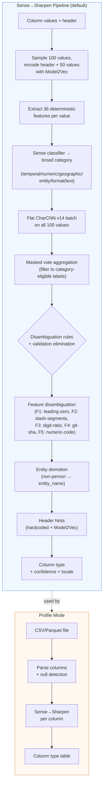

# FineType Architecture

This document covers the internal architecture for contributors and developers. For user-facing documentation, see the [README](../README.md).

## Inference Pipeline

FineType operates in three modes — single-value, column, and profile — each building on the previous.

The default **Sense→Sharpen** column pipeline:


```mermaid
flowchart TB
    subgraph sense ["Sense→Sharpen Pipeline (default)"]
        direction TB
        A["Column values + header"] --> B["Sample 100 values,
        encode header + 50 values
        with Model2Vec"]
        B --> B2["Extract 36 deterministic
        features per value"]
        B2 --> C["Sense classifier →
        broad category
        (temporal/numeric/geographic/
        entity/format/text)"]
        C --> D["Flat CharCNN v14 batch
        on all 100 values"]
        D --> E["Masked vote aggregation
        (filter to category-eligible labels)"]
        E --> F{"Disambiguation rules
        + validation elimination"}
        F --> F2["Feature disambiguation
        (F1: leading-zero, F2: slash-segments,
        F3: digit-ratio, F4: git-sha, F5: numeric-code)"]
        F2 --> G["Entity demotion
        (non-person → entity_name)"]
        G --> H["Header hints
        (hardcoded + Model2Vec)"]
        H --> I["Column type
        + confidence + locale"]
    end

    subgraph profile ["Profile Mode"]
        direction TB
        L["CSV/Parquet file"] --> M["Parse columns
        + null detection"]
        M --> N["Sense→Sharpen
        per column"]
        N --> O["Column type table"]
    end

    sense -.->|"used by"| profile

    style sense fill:#f0f7ff,stroke:#4a90d9
    style profile fill:#fff8f0,stroke:#d9904a
```

### Pipeline Stages

| Stage | What it does |
|---|---|
| **Model2Vec encoding** | Encodes column header and sample values into 128-dim embeddings using potion-base-4M. |
| **Feature extraction** | Computes 36 deterministic features per value: parse tests, character statistics, structural features. |
| **Sense classifier** | Cross-attention over Model2Vec embeddings predicts broad category (6 classes) and entity subtype (4 classes). ~3.6ms/column. |
| **Sibling-context attention** | Optional: 2-layer pre-norm transformer self-attention over all column headers enriches each column's embedding with cross-column context before Sense. |
| **Flat CharCNN** | Character-level CNN (250 classes) classifies each sample value independently. |
| **Masked vote aggregation** | Filters CharCNN votes to Sense-eligible labels via `LabelCategoryMap`. Safety valve: falls back to unmasked when confidence is low. |
| **Disambiguation** | Rule-based overrides for ambiguous type pairs. Validation-based candidate elimination rejects types where >50% of values fail JSON Schema validation. |
| **Feature disambiguation** | Post-vote rules using deterministic features: F1–F5 (leading-zero, slash-segments, digit-ratio, git-sha, numeric-code). |
| **Entity demotion** | When Sense detects non-person entity subtype and CharCNN votes full_name, demotes to entity_name. |
| **Header hints** | Hardcoded header mappings (priority) + Model2Vec semantic similarity matching. Geography protection and measurement disambiguation guards. |
| **Profile** | CSV/Parquet parsing with null detection, then column-mode inference on each column. |

### Why Sense→Sharpen?

Column classification is a two-stage problem: first determine *what kind* of data a column contains (temporal, numeric, geographic, etc.), then identify the *specific type* within that category.

1. **Sense** uses Model2Vec embeddings of the column header and sample values to predict a broad category. This is fast (~3.6ms) and leverages semantic information (column names like "timestamp" or "latitude") that character-level models miss.

2. **Sharpen** runs a flat CharCNN on individual values but masks the output to only category-eligible labels. This combines the character-pattern strength of CNNs (colons in MACs/IPv6, `@` in emails, dashes in UUIDs) with Sense's category guidance to eliminate impossible predictions.

3. **Feature disambiguation** applies 36 deterministic features post-vote to resolve confusable type pairs that share character patterns but differ in structural properties (leading zeros, segment counts, digit ratios).

A legacy tiered architecture (34 specialized CharCNNs in a T0→T1→T2 hierarchy) is available via `--sharp-only` for cases where Sense model files are absent.

### Why Candle?

Pure Rust, no Python runtime, no external C++ dependencies. Integrates cleanly with the DuckDB extension as a single binary with embedded weights. Good Metal/CUDA support for training.

## Crates

| Crate | Role | Key Dependencies |
|-------|------|------------------|
| `finetype-core` | Taxonomy parsing, tokenizer, synthetic data generation, validation | `serde_yaml`, `fake`, `chrono`, `uuid`, `jsonschema` |
| `finetype-model` | Flat CharCNN + Sense→Sharpen inference, feature extraction, column-mode disambiguation, Model2Vec | `candle-core`, `candle-nn` |
| `finetype-cli` | Binary: CLI commands (infer, profile, load, check, generate, taxonomy, schema, train, mcp) | `clap`, `csv` |
| `finetype-mcp` | MCP server library (rmcp, 6 tools, taxonomy resources) | `rmcp`, `tokio` |
| `finetype-duckdb` | DuckDB extension: 5 scalar functions with embedded model | `duckdb`, `libduckdb-sys` |
| `finetype-eval` | Evaluation binaries (profile, actionability, GitTables, SOTAB) | `csv`, `duckdb`, `arrow` |
| `finetype-train` | Pure Rust ML training (Sense, Entity, CharCNN, sibling-context attention, data pipeline) | `candle-core`, `candle-nn`, `duckdb` |
| `finetype-build-tools` | Build utilities (DuckDB extension metadata) | — |

### Dependency graph

```
finetype-core  (no internal deps — taxonomy, generators, validation)
    |
finetype-model (depends on core — CharCNN, tiered inference, column mode)
    |
    +--- finetype-cli   (depends on core + model + mcp — CLI binary)
    +--- finetype-mcp   (depends on core + model — MCP server library)
    +--- finetype-duckdb (depends on core + model — DuckDB extension)

finetype-eval  (standalone — eval binaries)
finetype-train (depends on core + model — training pipelines)
```

## Repository Structure

```
finetype/
├── crates/                         # Rust workspace members (see Crates above)
├── labels/                         # Taxonomy definitions (250 types, 7 domains, YAML)
├── models/                         # Pre-trained models (Sense, CharCNN, Model2Vec, Entity)
├── eval/                           # Evaluation infrastructure (GitTables, SOTAB, profile)
├── orbit/                          # Workflow artefacts (Card → Design → Spec → Ship)
│   ├── cards/                      # Feature cards
│   ├── specs/                      # Spike findings and research
│   └── decisions/                  # Architectural decision records (MADR format)
├── docs/                           # Architecture and development guides
└── .github/workflows/              # CI/CD: fmt, clippy, test, check; release cross-compile
```

## Taxonomy Definitions

Each of the 250 types is defined in YAML under `labels/`:

```yaml
datetime.timestamp.iso_8601:
  title: "ISO 8601"
  description: "Full ISO 8601 timestamp with T separator and Z suffix"
  designation: universal
  locales: [UNIVERSAL]
  broad_type: TIMESTAMP
  format_string: "%Y-%m-%dT%H:%M:%SZ"
  transform: "strptime({col}, '%Y-%m-%dT%H:%M:%SZ')"
  validation:
    type: string
    pattern: "^\\d{4}-\\d{2}-\\d{2}T\\d{2}:\\d{2}:\\d{2}Z$"
  tier: [TIMESTAMP, timestamp]
  samples:
    - "2024-01-15T10:30:00Z"
```

Key fields: `broad_type` (target DuckDB type), `transform` (DuckDB SQL expression using `{col}` placeholder), `validation` (JSON Schema fragment for data quality).

## Decision Register

30 architectural decisions in `orbit/decisions/` (MADR format). Browse with `ls orbit/decisions/`.

---

## Multi-Branch Classifier (v0.6.19 default for CLI / MCP / DuckDB)

FineType's classifier role is filled by the **multi-branch model** (sherlock-v19-relu-s42) as of v0.6.19. The Sense→Sharpen pipeline (described above) and the multi-branch pipeline both feed into the same Sharpen post-processing layer — Sharpen is shared infrastructure, not specific to either classifier. Multi-branch replaces Sense's *classification step* with a single forward pass per column; the Sharpen rules, header hints, and disambiguation logic that follow are unchanged.

Decisions: 0041 (multi-branch as the classifier role), 0042 (regex header hints deprecated in favour of learned approaches), 0048 (value-based rules only), 0038 (strength through simplification — prefer retraining over adding disambiguation rules). The Sense classifier remains in code and is conceptually preserved as the model architecture that can be selected when multi-branch artefacts aren't present.

### Column-level inference (multi-branch path)

Vector of strings + header → single column type:
1. Optional sibling-context attention enriches headers with cross-column context
2. Sample 100 values, extract 4-branch features (960 char + 512 embed + 36 stats + header)
3. Multi-branch forward pass → type label + confidence (single pass per column)
4. Sharpen post-processing (shared with the Sense path; no neural inference):
   - `feature_sharpen()`: F1–F6 rules on label + 36-dim ColumnFeatures
   - `value_sharpen()`: R1–R31 rules on label + values + confidence
   - `apply_header_sharpen()`: Model2Vec semantic header matching
5. Post-hoc locale detection via `validation_by_locale` patterns

Key implementation files: `column.rs` (Sharpen rules + pipeline), `semantic.rs` (header hints), `sibling_context.rs` (attention).

### Tiered model architecture (alternative fallback)

Available via `--sharp-only` when Sense files are absent:

```
Tier 0 (root): DuckDB-type router (VARCHAR, BIGINT, DOUBLE, DATE, etc.)
  → Tier 1: Domain routers (VARCHAR → address/code/person/internet/...)
    → Tier 2: Leaf classifiers (VARCHAR_person → email/full_name/username/...)
```

34 specialised CharCNN models. Graph in `models/tiered-v2/tier_graph.json`.

### Current taxonomy

240 definitions across 7 domains (container: 11, datetime: 84, finance: 28, geography: 25, identity: 33, representation: 33, technology: 26). Labels: `domain.category.type`. Definitions in `labels/definitions_*.yaml`.

## DuckDB Extension

| Function | Purpose |
|---|---|
| `finetype(col)` / `finetype(list, header?)` | Column-level classification |
| `finetype_detail(col)` / `finetype_detail(list, header?)` | Full detail (JSON) |
| `finetype_cast(value)` | Normalize value for TRY_CAST |
| `finetype_unpack(json)` | Recursively classify JSON fields |
| `finetype_validate(value, schema_json)` | Schema-driven validation (returns 'valid' or error message) |
| `finetype_version()` | Version string |

Uses multi-branch model downloaded at runtime via hf_hub (cached after first download). `FINETYPE_MODEL_DIR` env var overrides with local path. Chunk-aware column classification (~2048-row chunks). `finetype_validate` uses cached schema parsing for performance.

## MCP Server

`finetype mcp` starts an MCP server over stdio transport (rmcp v1.1.0). AI agents launch it as a subprocess.

**Tools (8):**

| Tool | Purpose |
|---|---|
| `infer` | Classify values (single or column mode with header) |
| `profile` | Profile all columns in CSV file (path or inline data) |
| `ddl` | Generate CREATE TABLE DDL from file profiling |
| `taxonomy` | Search/filter type taxonomy by domain/category/query |
| `schema` | Export JSON Schema — type-level (by key) or table-level (by file path/data) |
| `validate` | Schema-driven CSV validation — returns valid/invalid counts + error details |
| `generate` | Generate synthetic sample data for a type |

**Resources:** `finetype://taxonomy`, `finetype://taxonomy/{domain}`, `finetype://taxonomy/{d}.{c}.{t}`. All tools return JSON primary content + markdown summary. File tools accept `path` or inline `data`.

## Training Infrastructure (Detail)

**Crate:** `finetype-train` — pure Rust ML training on Candle. Metal auto-detected on macOS.

**`TrainingRenderer` trait** (`crates/finetype-train/src/tui.rs`): Display-only interface for training progress. Two implementations:
- **`TuiRenderer`** — ratatui alternate-screen dashboard (live loss/accuracy charts, epoch table, progress bar). Feature-gated behind `tui` (default on). No `enable_raw_mode()` — safe for unattended overnight runs.
- **`LogRenderer`** — `tracing::info!` fallback. Used when TUI init fails or `--no-tui` is passed.

**`results.json`** is the canonical source of training metrics — written **incrementally** (atomic temp+rename after each epoch) to the model output directory (e.g., `models/sherlock-v19-relu-s42/results.json`). Contains a JSON array of `EpochMetrics`.

**`epochs.jsonl`** — one compact JSON line per epoch, appended during training. Survives `tee` capture (unlike TUI escape codes). Use this for `tail -f` monitoring.

Read `results.json` or `epochs.jsonl` directly — overnight scripts, comparison queries, and post-hoc analysis should all use this structured output rather than parsing log files.

**`TrainingSummary`** is returned by `train_multi_branch()`: `best_epoch`, `best_val_accuracy`, `total_epochs`, `total_time_secs`, `epoch_metrics: Vec<EpochMetrics>`.

## Evaluation Infrastructure

**Profile eval** (`eval/profile_eval.sh`) — Multi-branch+Sharpen with sherlock-v19-relu-s42: **369/448 (82.4% label)** on the post-eval-expansion 448-row manifest (m-19; spec `orbit/specs/2026-04-21-eval-expansion/`). Manifest schema: 7 columns (`dataset, file_path, column_name, gt_label, source_url, licence, fetched_date`). 240-type taxonomy. Timestamp interchangeability tightened to format-compatible families (ISO, SQL, RFC 2822, MDY, DMY, YMD).

The CLI uses `FINETYPE_MODEL` env var (default: `models/default`); the eval script respects it (passed as `--model`). Note: `FINETYPE_MODEL_DIR` is a separate env var for the DuckDB extension only — see `DEVELOPMENT.md`.

**Actionability eval** — 578903/578949 (100%) transform success rate. 2 below-target columns remaining (multilingual/date, tech_systems/version).

**External benchmarks:** GitTables 1M (47.1% label), SOTAB CTA (43.6% label) — format-detectable subset only.

**Dashboard:** `make eval-report` generates `eval/eval_output/report.md`.

## Key File Reference

| What | Where |
|---|---|
| Taxonomy definitions | `labels/definitions_*.yaml` (7 domain files) |
| Column disambiguation + pipeline | `crates/finetype-model/src/column.rs` |
| Sense classifier | `crates/finetype-model/src/sense.rs` |
| Header hints (semantic) | `crates/finetype-model/src/semantic.rs` |
| Sibling-context attention | `crates/finetype-model/src/sibling_context.rs` |
| Table validator (core engine) | `crates/finetype-core/src/table_validator.rs` |
| CLI entry point | `crates/finetype-cli/src/main.rs` |
| MCP server + tools | `crates/finetype-mcp/src/` |
| DuckDB extension | `crates/finetype-duckdb/src/` |
| Training crate | `crates/finetype-train/src/` |
| Training TUI + renderer trait | `crates/finetype-train/src/tui.rs` |
| Multi-branch training loop | `crates/finetype-train/src/multi_branch.rs` |
| Training metrics (per model) | `models/<name>/results.json`, `models/<name>/epochs.jsonl` |
| Eval binaries | `crates/finetype-eval/src/bin/` |
| Golden integration tests | `crates/finetype-cli/tests/cli_golden.rs` |
| Eval config + schema mapping | `eval/config.env`, `eval/schema_mapping.yaml` |
| Eval manifest (7-col, 448 rows) | `eval/datasets/manifest.csv` |
| Source role manifest | `eval/datasets/sources.yaml` |
| Row-hash leakage firewall | `eval/row_hashes.tsv`, `scripts/eval_leakage/__init__.py`, `scripts/compute_row_hashes.py` |
| Eval pre-screen | `scripts/prescreen_eval.py`, `eval/pre-screen_floors.yaml` |
| Coverage gate | `scripts/eval_coverage_check.py`, `eval/datasets/csv/coverage_closure_phase_ab.csv` |
